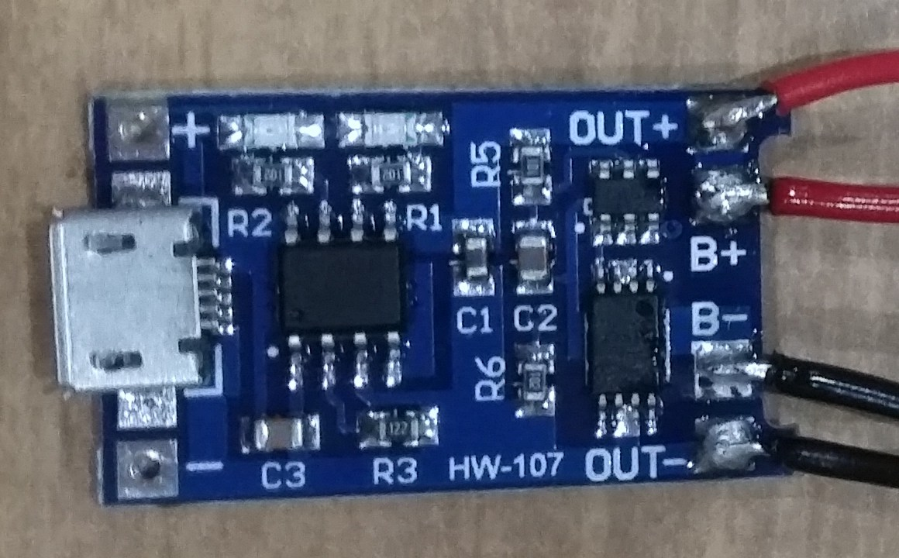
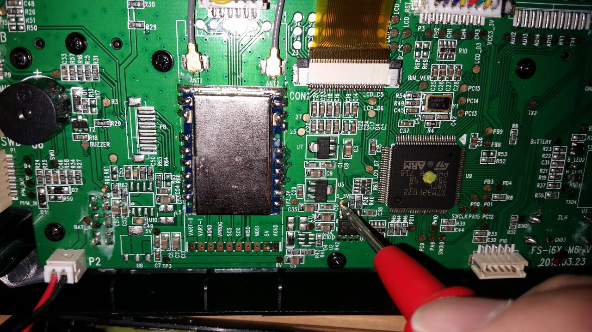

# Flysky i6X battery mod

## Introduction
I wanted to replace the AA batteries in my Flysky i6X transmitter with a rechargeable battery. While AA NiMH batteries would work, they still need to be taken out and then charged externally. My preference was to have a micro-usb charge port on the TX. I bought a TP4056 module, thinking that, along with a 18650 battery, it would be easy to install both inside the casing of the transmitter. However, the 18650 proved too big and I used a very old mobile phone battery instead. My aim was to do all this is cheaply as possible and at the same time I did not want to modify the TX so that I could not revert back to using the AA batteries if goes wrong.

## Components
1. TP4056 MicroUSB 5V 1A 18650 Lithium Battery Charger Module - [eBay, from a UK seller](https://www.ebay.co.uk/itm/TP4056-MicroUSB-5V-1A-18650-Lithium-Battery-Charger-Module/324115147653?ssPageName=STRK%3AMEBIDX%3AIT&_trksid=p2057872.m2749.l2649) ~ £1.65 delivered.
2. Rechargeable Li-Ion Battery. Not a 18650 since it does not fit, unless you are willing to destroy the battery compartment on your TX.

### TP4056 module
This module will both charge and protect single cell (1S) Li-Ion batteries with a cell voltage of 3.6V or 3.7V. The module actually includes a DW01 which takes care of the battery protection side. Note that it will only protect the battery from a over-discharge level of 2.4V, which is far too low for normal conditions. It is up to the user to stop discharging the battery at a more sensible value - probably 3.5V for a Li-Ion  battery under a moderate load. I highly recommend reading the information at [lygte-info.dk/info/BatteryChargePercent UK](https://lygte-info.dk/info/BatteryChargePercent%20UK.html) for more information on this topic.

### Battery
For the battery, I used a very flat, quite square BA-800 2500mAh cell from an old Sony Xperia S phone. Be sure that you check the dimensions of your battery very carefully. I initially bought a 18650 battery but this did not fit inside the Flysky i6X casing, which was a bummer. There are many other Lithium-based batteries that offer cell voltages of up to 3.85V. I chose to avoid these since the TP4056 datasheet only states that it supports Li-Ion batteries.

## Assembly
I soldered the battery directly to the TP4056 module. Nothing too complicated. It felt strange to solder the battery directly to the module, but leakage current is supposedly very low so it should be OK to leave the battery like this for quite some time - this is how battery banks work after all. Given that winter times will see a lot less flying, it may be useful to give it a charge somewhere during the cold months.

Exopy was used to fix the module inside the transmitter. I did this to make sure it could take the force inserting and removing the USB charging cable - hot glue may be too soft for this.

I wanted to use the charge/complete LEDs of the TP4056, but since they where inside the TX now, I had to improvise. I cut up a translucent LEGO block to act as a light conduit. I simply sliced it up a bit and worked it into the correct shape using a Stanley/Exacto/carpet knife. 

The final result worked quite well. I glued it in place with a glue-gun, which meant I could re-adjust it if it went wrong.

## Measure capacity
While I did not really need to estimate the capacity of the battery if it was new, I was curious to know how much capacity was left in the old battery that I chose for this project. So I rigged up a resistor load to draw about 160mA-180mA, a value I felt was reasonable for the TX to draw, and then logged the battery voltage as it drained using an [Arduino Uno](./battmonitor.ino).  From here, I did some basic Ohm's law math to work out the capacity.

### Logging the Arduino output to disk
	picocom -b 9600 /dev/ttyACM0 -l | ts "%H:%M:%S" | tee batt5.log

	17:43:40 picocom v3.1
	17:43:40 
	17:43:40 port is        : /dev/ttyACM0
	17:43:40 flowcontrol    : none
	17:43:40 baudrate is    : 9600
	17:43:40 parity is      : none
	17:43:40 databits are   : 8
	17:43:40 stopbits are   : 1
	17:43:40 escape is      : C-a
	17:43:40 local echo is  : no
	17:43:40 noinit is      : no
	17:43:40 noreset is     : no
	17:43:40 hangup is      : no
	17:43:40 nolock is      : yes
	17:43:40 send_cmd is    : sz -vv
	17:43:40 receive_cmd is : rz -vv -E
	17:43:40 imap is        : 
	17:43:40 omap is        : 
	17:43:40 emap is        : crcrlf,delbs,
	17:43:40 logfile is     : none
	17:43:40 initstring     : none
	17:43:40 exit_after is  : not set
	17:43:40 exit is        : no
	17:43:40 
	17:43:40 Type [C-a] [C-h] to see available commands
	17:43:40 Terminal ready
	17:43:42 771	3.79
	17:49:46 768	3.77
	17:58:44 765	3.76
	18:07:47 762	3.74
	18:16:54 759	3.73
	18:26:56 756	3.71
	18:39:01 753	3.70

### Discharge voltage graph

The battery lasted about 6h30 and had an estimated capacity of just over 1000mAh (it was sold as 2500mAh about 10 years ago, so it has lasted well enough). This should be good enough for multiple flights.

## Calibrate and test the TX
The Flysky i6X starts to warn of a low battery at about 4.2V. The Li-Ion is 'empty' at about 3.5V. I therefore calibrated the TX to start warning at this value instead. To do this, switch off the TX, pull both stickts down and left, then switch it on. This will enter what some call the 'secret menu'. Scroll through the menu and find the TX voltage and adjust it appropriately. For me this was quite simple since I did this when the battery was empty, so all I did was adjust the voltage threshold until the mad beeping stopped.

*Here's a few shots of the charge light and final voltage when charging is complete.*

I measured the 3.3V supplies when the battery was full (4.1V) and they both read 3.3V, which was a good indication that things might work. When I switched on the TX and RX, they both communicated as before and the RSSI indicated a full signal, so job done.

## Final thoughts
It all works as expected and I can now charge my Flysky i6X using a 5V micro-USB charger. It should have cost me around £6/£7 to achieve this, expect I bought the wrong battery initially, so worked out a tiny bit more. Technically, since I had the fallback  battery lying around, it could have cost me less.

On other thing: I should have done a side-by-side transmitter range test to make sure the lower supply voltage (3.7V Li-Ion vs. 6.0V AA batteries) did not affect range.

